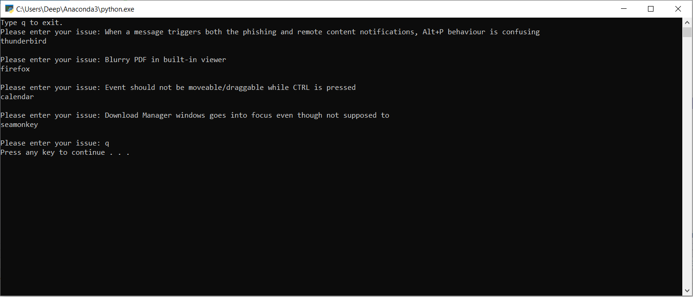

# Natural Language Processing: Support Ticket Prediction

### Final Project Report 
Google Colab link: https://colab.research.google.com/drive/1kT3AiHeJQAsN_CmwqizjQuZQkgMqk0mP?usp=sharing

The purpose of this project is to identify a project label given a text or a description of a support ticket. In many big companies, support tickets are handled by some type of tracking system like ServiceNow [1] or Jira [2], but when an issue is raised, then somebody from the team has to assign that ticket to the team who is responsible for resolving that issue. Obviously, this requires knowledge about all the ongoing projects, so that the person is able to assign the ticket to the correct team. Now, in the real world within a real company, there could be many ongoing projects, and they only have that one person who knows about all the projects, which is just not very productive. That’s where we can use this predictive model which can quickly label a project based on the description of the issue. 

This whole project included six major parts, data preprocessing, data exploration, converting to TF-IDFs, splitting, balancing, and picking the best model. Data preprocessing included removing missing rows, contractions, tokenizing, noise cleaning, removing stop words, punctuations, and lemmatizing words. Data exploration is a part where visualization helped give a clear picture of the terms that appeared in different projects. To further understand the data itself, uni-gram, bi-gram, and tri-gram were used. N-gram gave a further detailed picture of each of the projects, and how some of them were related to each other. After this stage, TF-IDF was applied to the entire corpus. The purpose is to get the importance of each word relative to the corpus. In addition, the TF-IDF vector was also saved at this stage with the help of a module called Joblib[3]. The splitting of the dataset was done before balancing the dataset, because we do not want any synthetic data to leak in the test set, otherwise, the model would end up giving the best accuracy, which would not be correct. Balancing the data was done via a module called SMOTE [4], which essentially helped generate minority classes. Finally, different models were trained, namely Naïve Bayes, Decision Tree, Random Forest, and Logistic Regression. Given the issues of four different projects, Logistic Regression ended up giving us the best accuracy of 77%. In this case, we can rely on accuracy as our best performance metric before our training dataset was fully balanced. 

In terms of challenges, I did face two major challenges, which were balancing the dataset and transforming the new text into a TF-IDF vector. With regards to SMOTE, all this time I thought it could only be applied for binary classification because the package is implemented for binary classification. However, after spending many hours and research, I came to the conclusion that if you apply this technique in sequence for n times (where n is the number of under sampled classes), then it will eventually balance all the classes. The second challenge was to convert the new text entered by the user into a TF-IDF vector, which can then be passed to the model for prediction. After multiple hours of research, the solution was pretty simple. First, save the TF-IDF vectorizer using pickle or Joblib, then load this vector and call transform function to transform the text into the correct TF-IDF vector which can then easily passed into the model. 

Please run project_predictor.py to predict any support tickets. 

[1] https://www.servicenow.com/  
[2] https://www.atlassian.com/software/jira  
[3] https://joblib.readthedocs.io/en/latest/  
[4] https://imbalanced-learn.org/stable/over_sampling.html  
